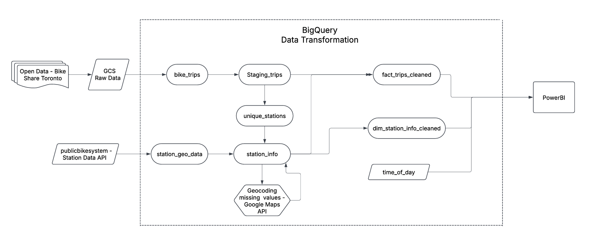
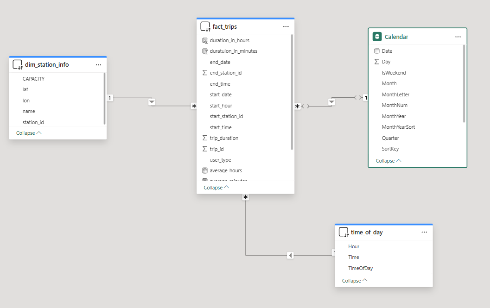
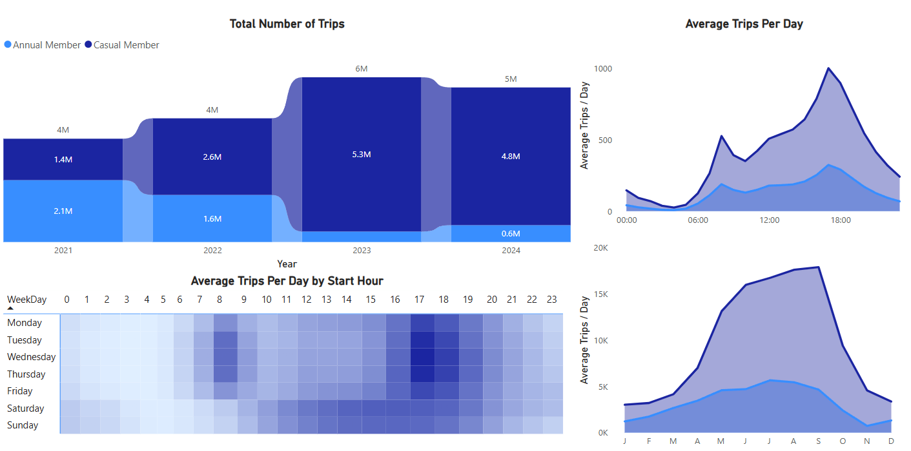

# Toronto Bike Share Data Analysis

## Overview

This project analyzes Toronto Bike Share data to gain insights into ridership patterns, station usage, and popular routes. The analysis utilizes Google Cloud Platform (GCP) services for data storage, transformation, and analysis.

## Tools Used

* **Google Cloud Storage (GCS):** For raw data storage.
* **BigQuery:** For data warehousing, transformation, and analysis.

## Data Source

* [Bike Share Toronto Ridership Data](https://open.toronto.ca/dataset/bike-share-toronto-ridership-data/)

## Data Extraction

1.  **GCS Data Storage:**
    * Raw data from 2021 to 2024 was loaded into a GCS bucket (`bike_share_toronto/source`).
2.  **BigQuery External Table:**
    * A BigQuery external table (`bike_trips`) was created to access the data directly from GCS.
    * Due to timestamp format inconsistencies, `Start_Time` and `End_Time` were initially defined as `STRING`.
    * Total row count: 18,930,951.
3.  **Station Geo Data Extraction:**
    * A Python script was used to fetch station geo data (latitude, longitude, capacity) from a public API and load it into the `station_geo_data` table in BigQuery.
    * API used: [Station Information](https://tor.publicbikesystem.net/ube/gbfs/v1/en/station_information)

## Data Transformation (BigQuery)

The data transformation process in BigQuery is visualized in the flowchart below. It outlines the flow of data from the raw data sources (Open Data Toronto and the Station Data API) through the various tables and transformations, culminating in the final tables used for analysis.

Key stages include:
* Ingestion of raw data from Open Data Toronto and the Station Data API.
* Creation of initial tables (`bike_trips`, `station_geo_data`).
* Staging and transformation steps (`staging_trips`, `unique_stations`, `station_info`).
* Geocoding of station data.
* Creation of final cleaned tables (`fact_trips_cleaned`, `dim_station_info_cleaned`).

1.  **Staging Table Creation (`staging_trips`):**
    * A staging table was created to hold transformed data.
    * Transformations included:
        * Data type conversions.
        * Timestamp standardization.
        * Removal of rows with null `End_Station_Id`.
        * Addition of a duration column.
2.  **Unique Station View (`VW_unique_trips_stations`):**
    * A view was created to extract unique station IDs and names from the staging table.
3.  **Station Information Table (`station_info`):**
    * Created station_info table in staging dataset using station_geo_data table.
    * The `station_info` table was enriched by adding missing stations from the unique station view.
4.  **Geocoding:**
    * A geocoding service (Google Maps API) was used to obtain latitude and longitude coordinates for stations with missing location data.
    * Geocoded data was stored in `geocoded_stations` table, and then joined into the `station_info` table.
5.  **Data Cleaning:**
    * Records with invalid station IDs and null end stations were removed.
    * Missing capacity values were imputed using the mode.
    * Final cleaned station information was stored in the `dim_station_info` table.
6.  **Fact Table Creation (`fact_trips`):**
    * A fact table was created with the final cleaned trip data, ready for analysis.
    * The table includes the following.
        * Trip ID
        * Trip Duration
        * Start Station ID
        * Start Time Timestamp
        * Start Date
        * Start Time
        * Start Hour
        * End Station ID
        * End Time Timestamp
        * End Date
        * End Time
        * User Type

## Data Model

* **Fact Table:** `fact_trips`
* **Dimension Table:** `dim_station_info`

## Analysis and Visualization

   The analysis of the Toronto Bike Share data was visualized using Power BI. Key insights are presented in interactive dashboards.

   ###   Power BI Data Model

   The Power BI data model, illustrates the relationships between the tables used for visualization.
   
   

   The model consists of the following tables:

   * **fact_trips:** This is the fact table containing the cleaned trip data, including trip duration, start and end times, station IDs, and user type.
   * **dim_station_info:** This dimension table contains information about the bike stations, such as station ID, name, latitude, longitude, and capacity.
   * **Calendar:** This table provides date-related attributes for filtering and analyzing data by time periods.
   * **time_of_day:** This table provides time-related attributes for filtering and analyzing data by time of day

   Relationships between tables are defined as follows:

   * `fact_trips` has a many-to-one relationship with `dim_station_info` using the `start_station_id` and `end_station_id` columns.
   * `fact_trips` has a many-to-one relationship with `Calendar` using the `start_date` and `end_date` columns.
   * `fact_trips` has a many-to-one relationship with `time_of_day` using `start_hour`.

   ###   Preliminary Analysis

   The following image shows a combined view of several preliminary analyses of the Toronto Bike Share data:

   

   **Key Insights:**

   * The total number of trips has generally increased from 2021 to 2023, with a dip in 2024 (likely due to incomplete data for the year). Annual members consistently make up a larger proportion of total trips compared to casual members. There was a significant surge in trips in 2023.
   * Peak usage occurs during typical commuting hours (morning and evening), suggesting that bike sharing is used for commuting. Annual members show a more pronounced peak during these hours compared to casual members.
   * Ridership is highest during the summer months (May to September), indicating a strong seasonal component to bike share usage.
   * Weekdays show clear peaks during commuting hours, confirming the commuting pattern. Weekends show a more spread-out usage pattern, with peaks around midday, suggesting recreational use.

## Next Steps

* Visualization of the data using Power BI.
* Further analysis of ridership trends and patterns.
* Development of predictive models.
